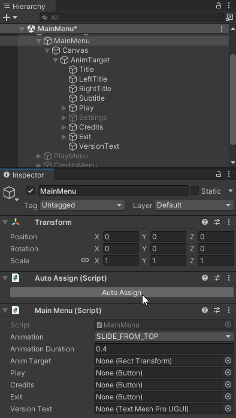

# Auto Assign
This Package provides a simple "Auto Assign" Button that compares the type and name of your fields to the type and name of any child component and assigns them accordingly. 



No more time wasted dragging and dropping, reassigning or accidentally messing up the hierarchy.

## Install
```
Window -> Package Manager -> + -> Add package from git URL...
git@github.com:egon-r/AutoAssign.git
```

## Usage
1. Decorate your class with `[AutoAssignable]`
    ```
    using ERAutoAssign;

    [AutoAssignable]
    public class MainMenu: AnimatedMenu
    {
        public Button Play;
        public Button Credits;
        public Button Exit;
        public TextMeshProUGUI VersionText;
    }
    ```
2. Add the `Auto Assign` component to the same component.
3. Click on `Auto Assign` to automatically assign all variables.

## ManualAssign
If a field cannot be matched with a child it is set to null so the status of the field after pressing "Auto Assign" is clear. To avoid this behaviour decorate the field with `[ManualAssign]`. 
```
[AutoAssignable]
public class MainMenu: AnimatedMenu
{
    public Button Play;
    public Button Credits;
    public Button Exit;
    [ManualAssign]
    public TextMeshProUGUI VersionText;
}
```

---
## License
This project is licensed using the CC-BY license. This is a human-readable summary of (and not a substitute for) the license: 
```
You are free to:
Share — copy and redistribute the material in any medium or format
Adapt — remix, transform, and build upon the material
for any purpose, even commercially.

Under the following terms:
Attribution — You must give appropriate credit, provide a link to the license, and indicate if changes were made. You may do so in any reasonable manner, but not in any way that suggests the licensor endorses you or your use.

No additional restrictions — You may not apply legal terms or technological measures that legally restrict others from doing anything the license permits.
``` 